# Activity 5: React Tools & Music App with Fixed Data

**Course:** Web Application Development  
**Instructor:** Bobby Estey  
**Author:**   ADEWALE OLAOMO  
**Date:** March 14, 2026

---

## Project Overview

The Community Resource and Event Management System is a website that helps groups like churches and non-profits manage shared resources and schedule events. Many organizations use spreadsheets, emails or handwritten lists which can cause scheduling conflicts and miscommunication. This system provides a centralized digital solution.
This activity focuses on building a React application that displays music album information. The project demonstrates fundamental React concepts including components, props, state management with hooks, and event handling.

Code Git Link: https://github.com/whaleswqeb/Topic_5_JavaScript_Web_Application_Development/tree/main/Code

---

## Part 1: Music App Initial Setup

### Screenshots

**Figure 1: Floder Structure of the React Application**

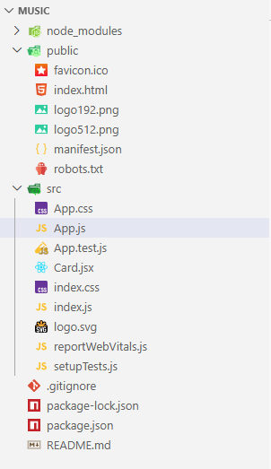

---

**Figure 2: React Application Running**

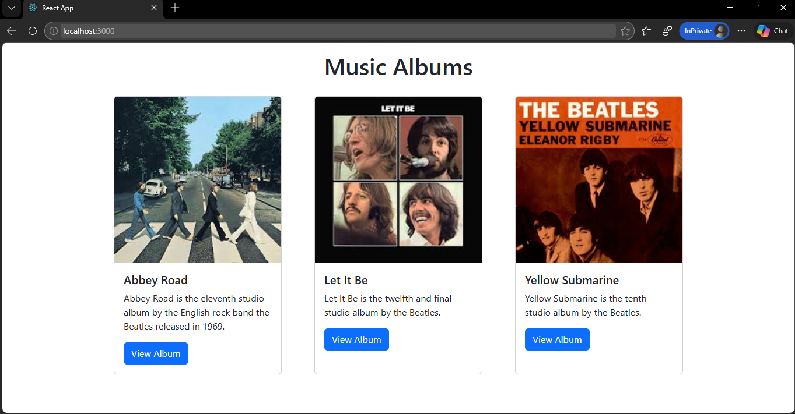

---

**Figure 3: Creating Index.js**

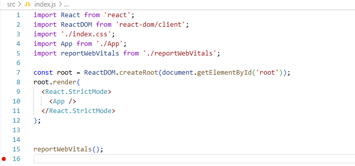

---

**Figure 4: Adding Bootstrap CSS**

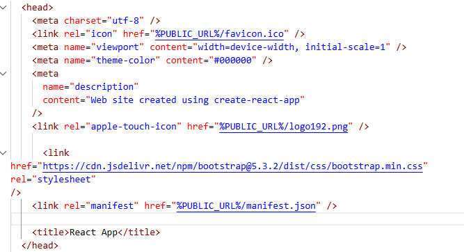

---

**Figure 5: Card Component JSX Layout**

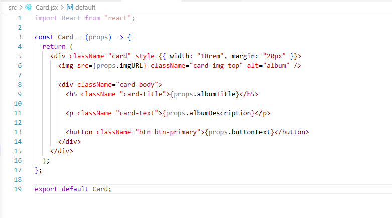

---

**Figure 6: Props Passing to the Card.jsx**

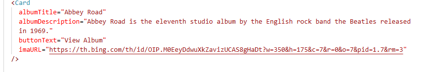

---

**Figure 7: Importing Card**

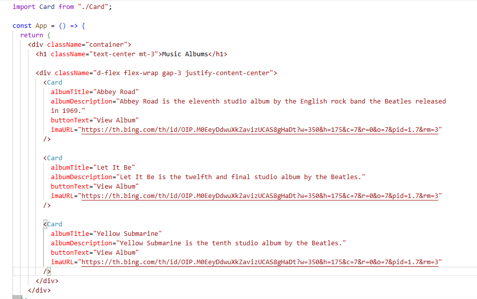

---

**Figure 8: Responsiveness of Application**

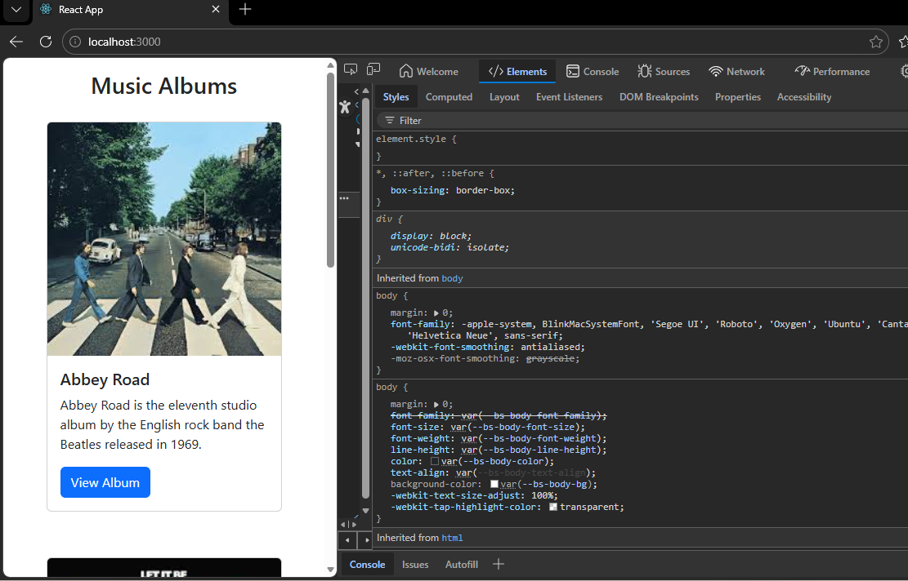

---

### Part 1 Summary

In Part 1, I built a React app from scratch using create-react-app. I learned JSX syntax rules including single parent element requirement and using className instead of class. I integrated Bootstrap CSS for styling and created a card interface. When I needed multiple cards, copying HTML proved inefficient, so I created a reusable Card component. I then enhanced it with props so each card could display different album data while maintaining the same structure. This separation of structure from content is fundamental to React development.

---

## Part 2: State Changer Demo (Mini App)

### Screenshots

**Figure 9: Statechanger App**

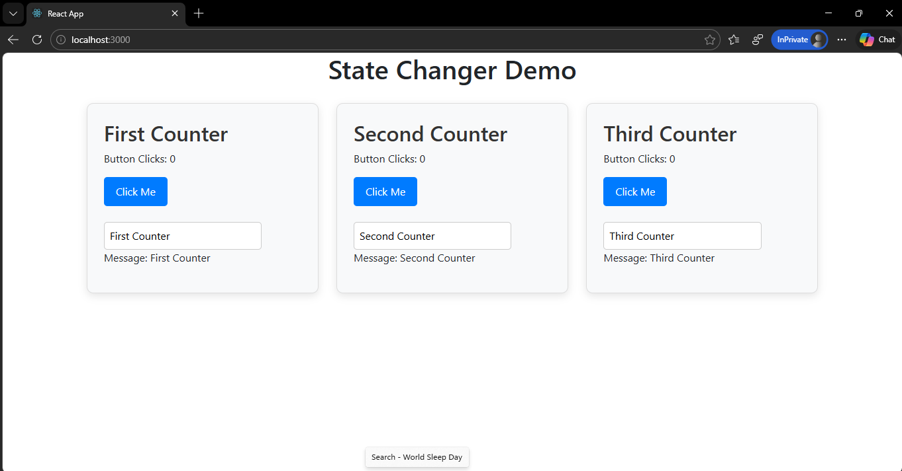

---

**Figure 10: useState Hook Code**

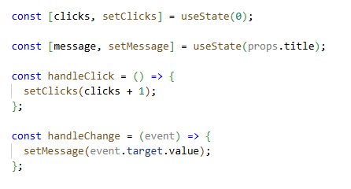
---

**Figure 11: App.js Of StateChanger App**

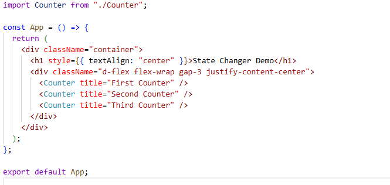

---

**Figure 12: Counter.css**

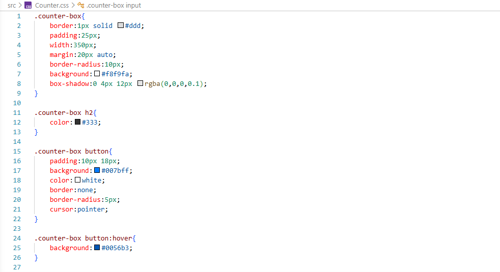

---

**Figure 13: After Clicks on Button**

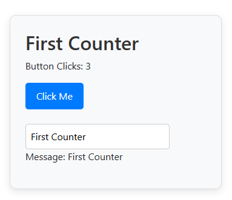

---

**Figure 14: Message Change**

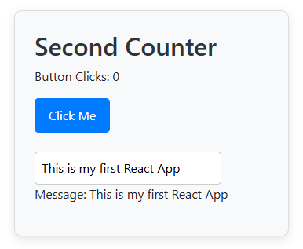

---

**Figure 15: Multiple Counters**

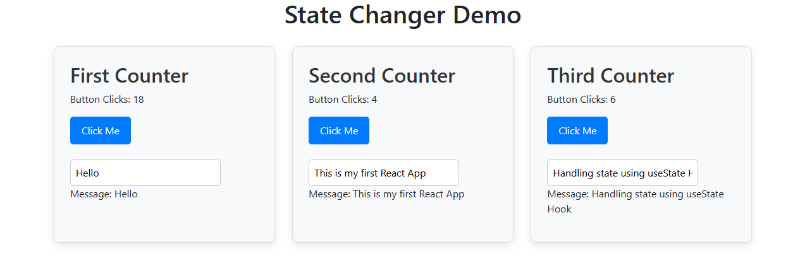

---

### Part 2 Summary

The State Changer Demo introduced React hooks, specifically useState. Before hooks, only class components could have state. Now functional components can use state through hooks. The Counter component demonstrated two independent state variables: one tracking button clicks and another tracking text input. Each state maintains its own value and update function. When state changes, React automatically re-renders the component. The input demonstrated the controlled component pattern where form elements are controlled by React state. Adding three Counters showed each maintains its own independent state, proving state encapsulation.

---

## Part 3: Music App with State and Props

### Screenshots

**Figure 16: App.js**

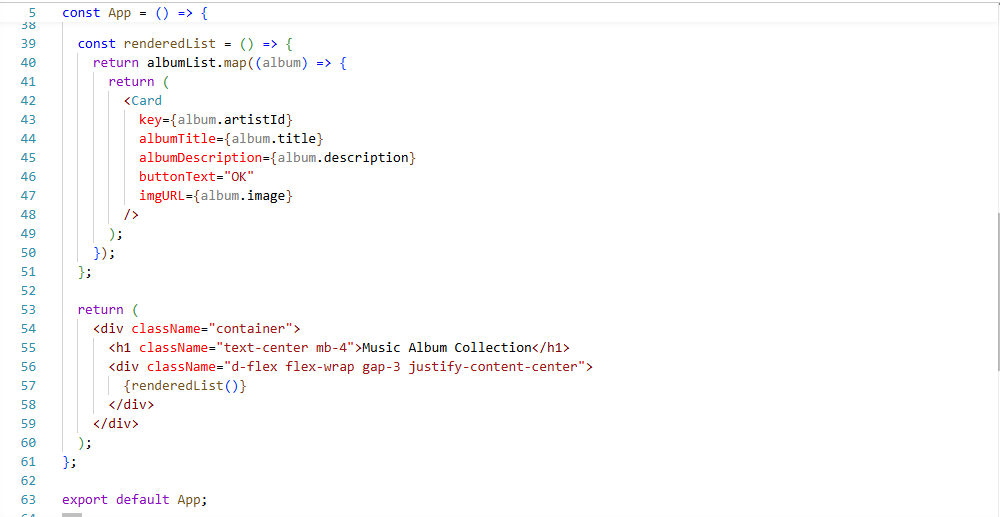

---

**Figure 17: Album Data Array**

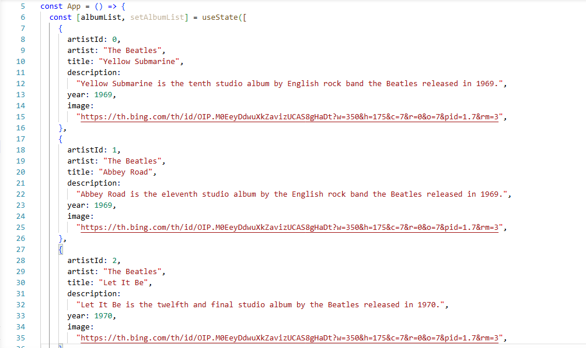

---

**Figure 18: RenderedList Function**

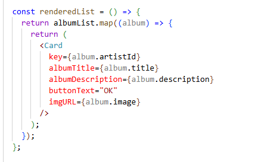

---

**Figure 19: Card.jsx**

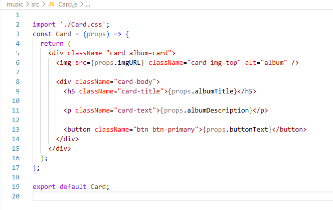

---

**Figure 20: Browser View**

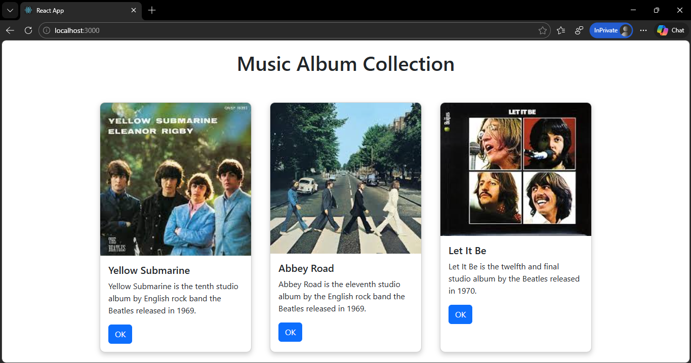

---

**Figure 21: Made responsive**

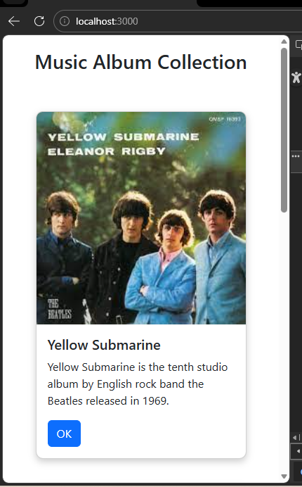

---

**Figure 22: Final Application**

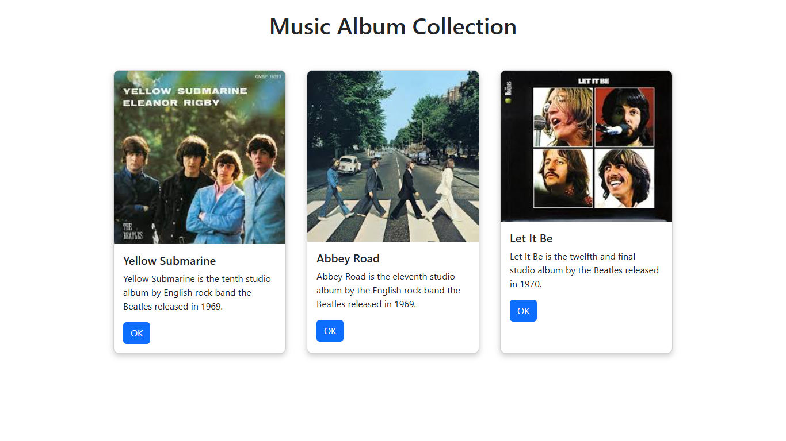

---

### Part 3 Summary

Applying state concepts to the music app transformed how album data is managed. Instead of hardcoding Card props, the App component now maintains an albumList state array. The renderedList function uses map to transform each album object into a Card component. This makes the application more maintainable and scalable, as adding albums just requires adding objects to the state array. The map function, practiced with simple examples, proves essential for transforming data into UI components. Flexbox styling creates a responsive horizontal layout with cards wrapping on smaller screens. The key prop on each Card helps React efficiently update the DOM.

---

## Map Function Examples

To understand map, I have added this code for rendering the list inside the App.js:

```
<div className="card-container">
  {albumList.map((album) => (
    <div className="card" key={album.id}>
      

      <div className="card-body">
        <h3 className="album-title">{album.title}</h3>
        <p className="album-artist">Artist: {album.artist}</p>
        <p className="album-year">Year: {album.year}</p>
        <p className="album-description">{album.description}</p>

        <button className="btn btn-primary">
          View Album
        </button>
      </div>
    </div>
  ))}
</div>
```

In the music app, map works the same way but returns JSX Card components instead of strings.

---

## Key Terminology

| Term                 | Definition                                                              |
| -------------------- | ----------------------------------------------------------------------- |
| React                | JavaScript library for building user interfaces through components      |
| JSX                  | Syntax extension allowing HTML-like code in JavaScript                  |
| Component            | Reusable piece of UI that returns JSX                                   |
| Props                | Read-only data passed from parent to child component                    |
| State                | Mutable data within a component that triggers re-rendering when changed |
| useState             | React hook adding state to functional components                        |
| Hook                 | Functions that let components "hook into" React features                |
| Map                  | JavaScript array method transforming each element into something new    |
| Controlled Component | Form element whose value is controlled by React state                   |
| Flexbox              | CSS layout model for arranging elements flexibly                        |

---


**Final Summary**

In this activity, I explored several important concepts used in modern React development.  
* I figured out how to make parts of the user interface in React that I can use again. This helps keep the application organized. It is easier to take care of the application. I made React components that represent different parts of the user interface. 
* I used props to share data, between components.
Props help a parent component give information to child components.
This makes components flexible and reusable because they can work with data.
I pass data from a parent to a child using props.
This way I can make components that work in different ways.  
* I took a look, at how to manage state with React hooks. The state is really important because it lets components keep track of and change values that're not always the same. This happens when people use the application or when something else happens in the application. State is what makes this possible for components. 
* Using the map function to make all these elements was really helpful. It reminded me of the ideas behind making React applications like making small parts that work together managing what is happening at any given time and making the user interface change on the fly. React development is about these things. They are the basics that you need to know to make interactive web applications, with React.