# Activity 6: React Music App – API Data

**Course:** Web Application Development  
**Instructor:** Bobby Estey  
**Author:**   Adewale Olaom  
**Date:** March 20, 2026


## Part 3 – External Data Sources

### Overview

In Part 3, the music application was updated to load album data from an external source rather than hardcoding it inside the component. This progressed through two stages: first loading data from a local JSON file, and then fetching data from a live REST API using Axios.

---

### Feature 1: Moving Album Data to a JSON File

The album array was removed from the `App.js` state initialization and placed into a separate file called `albums.json` inside the `src` folder. The `App.js` file was updated to import this JSON file and use `useEffect` to load the data into state on component mount.

**Key code in App.js:**

```js
import React, { useState, useEffect } from 'react';
import Card from './Card';
import SearchForm from './SearchForm';
import './App.css';
import albums from './albums.json';

const App = (props) => {
  const [albumList, setAlbumList] = useState([]);

  // Setup initialization callback
  useEffect(() => {
    // Update the album list
    setAlbumList(albums);
  }, [albumList]);
```

> **App.js with albums.json import and useEffect**
 
 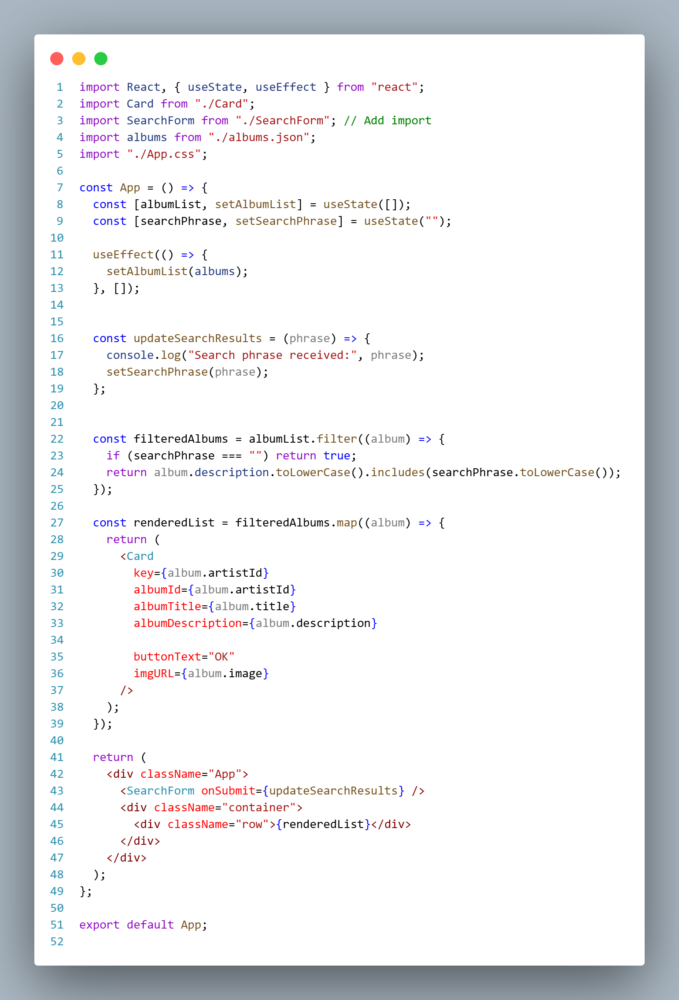


---

### Feature 2: Key Values in a List

React requires each element in a rendered list to have a unique `key` prop. The `albumList.map()` call in `App.js` was updated to pass `album.id` as the `key` for each `<Card />` component. This resolved the console warning about missing keys.

```js
return (
  <Card
    key={album.id}
    albumId={album.id}
    albumTitle={album.title}
    albumDescription={album.description}
    buttonText="OK"
    imgURL={album.image}
  />
);
```

> **Cards with key prop added**

 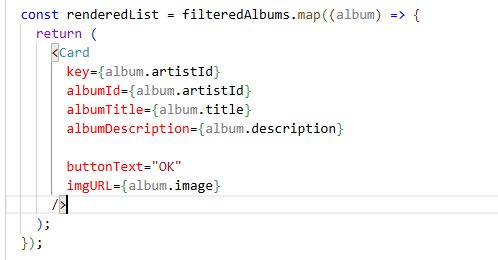

---

### Feature 3: SearchForm Component

A new `SearchForm.js` component was created to allow users to search for albums. It uses Bootstrap for styling and React's `useState` to track the text input value. It uses `onChange` to update state as the user types, and `onSubmit` to send the search phrase up to the parent `App` component via a callback prop.

```js
import React, { useState } from 'react';

const SearchForm = (props) => {
  const [inputText, setInputText] = useState("");

  const handleChangeInput = (event) => {
    setInputText(event.target.value);
    console.log(inputText);
  };

  const handleFormSubmit = (event) => {
    event.preventDefault();
    props.onSubmit(inputText);
  };

  return (
    <div>
      <form onSubmit={handleFormSubmit}>
        <div className='form-group'>
          <label htmlFor='search-term'>Search for</label>
          <input
            type='text'
            className='form-control'
            placeholder='Enter search term here'
            onChange={handleChangeInput}
          />
        </div>
      </form>
    </div>
  );
};

export default SearchForm;
```

> **SearchForm in the browser**

 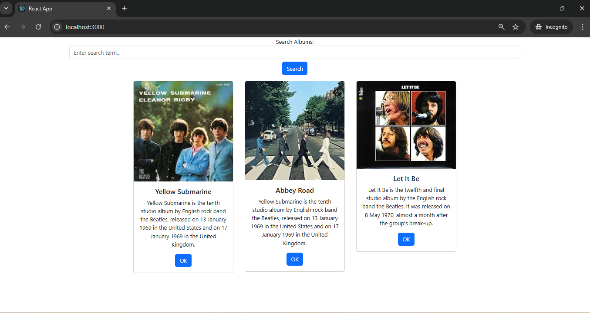

> **Browser console showing input being logged as user types**

 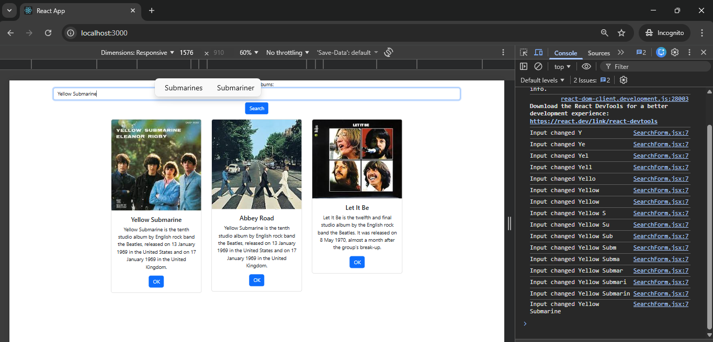

---

### Feature 4: Search Filtering with Callbacks

A new state variable `searchPhrase` and a method `updateSearchResults` were added to `App.js`. The `updateSearchResults` method was passed as a prop to `<SearchForm />`. This demonstrates the React callback pattern: data flows down through props, and events flow back up through callback functions.

The `renderedList` method was updated to filter albums whose description contains the search phrase (case-insensitive).

```js
const updateSearchResults = (phrase) => {
  console.log('phrase is ' + phrase);
  setSearchPhrase(phrase);
};
```

```js
const renderedList = () => {
  return albumList.map((album) => {
    if (
      album.description.toLowerCase().includes(searchPhrase.toLowerCase()) ||
      searchPhrase === ''
    ) {
      return (
        <Card
          key={album.id}
          albumId={album.id}
          albumTitle={album.title}
          albumDescription={album.description}
          buttonText='OK'
          imgURL={album.image}
        />
      );
    } else console.log('Does not match ' + searchPhrase);
  });
};
```

> **Filtered search results in the browser**

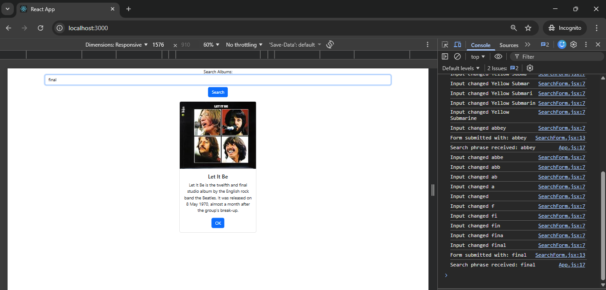


---

### Feature 5: Fetching Data from REST API with Axios

The album data source was migrated from the local JSON file to the Express REST API built in Activity 1. The `axios` library was installed and a `dataSource.js` file was created to configure the base URL.

**Install Axios:**
```
npm install axios
```

**dataSource.js:**
```js
import axios from 'axios';

export default axios.create({
  baseURL: 'http://localhost:3000'
});
```

**Updated App.js using async/await:**
```js
import dataSource from './dataSource';

const loadAlbums = async () => {
  const response = await dataSource.get('/albums');
  setAlbumList(response.data);
};

useEffect(() => {
  loadAlbums();
}, [refresh]);
```

### Part 3 Summary

In Part 3, the music application was enhanced to load its album data from external sources instead of hardcoded values. First, the album array was moved into a `albums.json` file and loaded using `useEffect` and `useState`. Then, the `SearchForm` component was built using Bootstrap and React hooks, with `onChange` and `onSubmit` event handlers. The callback pattern was used to pass the search phrase from the child `SearchForm` component back up to the parent `App` component, which then filtered the album list. Finally, the `axios` library was installed and configured to fetch albums from the Express REST API using `async/await`, completing the transition from static data to a live data source.

**New terminology defined:**

- **useEffect**: A React hook that runs a callback function after the component renders. It is used for side effects such as fetching data from an API.
- **useState**: A React hook that declares a state variable and a setter function. Changing the value via the setter causes the component to re-render.
- **Callback function**: A function passed as a prop from a parent to a child component. When the child calls it, the parent's code executes — used here to pass the search phrase upward.
- **Props**: Read-only data passed from a parent component down to a child component.
- **Axios**: A promise-based HTTP client library used to fetch data from REST APIs. It handles errors with try/catch and returns data already in JSON format.
- **async/await**: JavaScript ES6 syntax for writing asynchronous (non-blocking) code in a readable, synchronous style. `async` marks a function as asynchronous; `await` pauses execution until a promise resolves.
- **onChange**: A React event handler triggered every time the value of an input element changes.
- **onSubmit**: A React event handler triggered when a form is submitted (e.g., when the user presses Enter).

---

---

## Mini App #2 – Routing Application Demo

### Overview

A separate React application called `router` was created to demonstrate the use of `react-router-dom`. This application shows how URLs in the browser can be mapped to different components, and how access to certain routes can be restricted to authenticated users using a `PrivateRoute` pattern.

---

### Setup

A new React project was created and the `react-router-dom` library was installed:

```
npx create-react-app router
cd router
npm install react-router-dom --save
npm start
```

---

### Components Created

**index.js** – Renders the root `App` component into the DOM.

**App.js** – Defines all routes using `BrowserRouter`, `Routes`, and `Route`. Manages the `isLoggedIn` state. Passes `handleLogin` as a prop to `LoginPage`. Wraps protected routes inside `PrivateRoute`.

**ContactUs.js** – Displays company contact information. Protected by `PrivateRoute`.

**AboutThisSite.js** – Displays an about page. Protected by `PrivateRoute`.

**LoginPage.js** – Displays a login button. Uses `useNavigate` and `useLocation` hooks from `react-router-dom`. Calls `props.onClick(from, navigate)` on login, passing navigation control back to the parent.

**PrivateRoute.js** – Checks the `authorized` prop. If true, renders `props.children` (the protected component). If false, redirects to `/login` and saves the requested location in state so the user can be redirected after logging in.

**NavBar.js** – A Bootstrap-styled navigation bar with links to `/about`, `/contact`, `/login`, and `/user/Ned Navigator`.

**User.js** – Uses `useParams()` from `react-router-dom` to extract the `username` from the URL and display it.

---

### Key Code Snippets

**PrivateRoute.js:**
```js
import React from 'react';
import { Navigate, useLocation } from 'react-router-dom';

const PrivateRoute = (props) => {
  const authorized = props.authorized;
  const location = useLocation();
  return authorized ? (
    props.children
  ) : (
    <Navigate to='/login' state={{ from: location }} />
  );
};

export default PrivateRoute;
```

**App.js route setup (partial):**
```js
<BrowserRouter>
  <NavBar />
  <Routes>
    <Route path='/' element={<RootElement />} />
    <Route
      path='/about'
      element={
        <PrivateRoute authorized={isLoggedIn}>
          <AboutThisSite />
        </PrivateRoute>
      }
    />
    <Route
      path='/contact'
      element={
        <PrivateRoute authorized={isLoggedIn}>
          <ContactUs />
        </PrivateRoute>
      }
    />
    <Route path='/login' element={<LoginPage onClick={handleLogin} />} />
    <Route path='/user/:username' element={<User />} />
  </Routes>
</BrowserRouter>
```

---

### Screenshots

> **App home page at localhost:3001/**

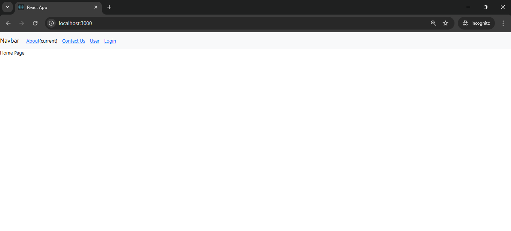

> **Attempting to access /about before login (redirected to /login)**

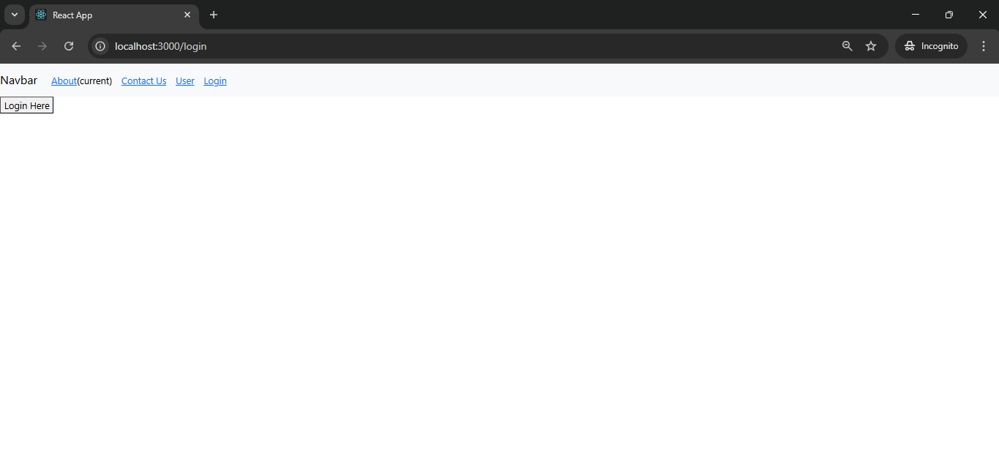

> **/about page after successful login**

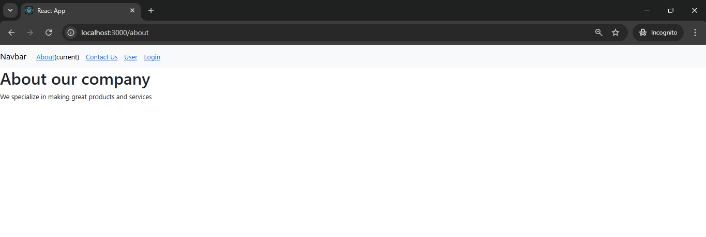


> **/contact page**

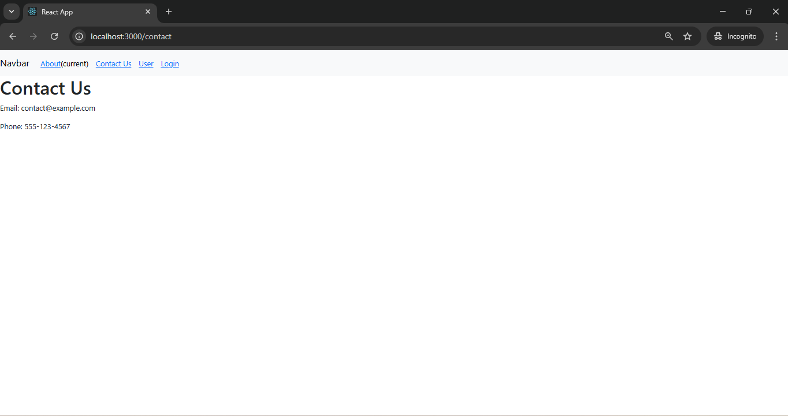

> **/user/:username page (e.g., /user/Mary)**

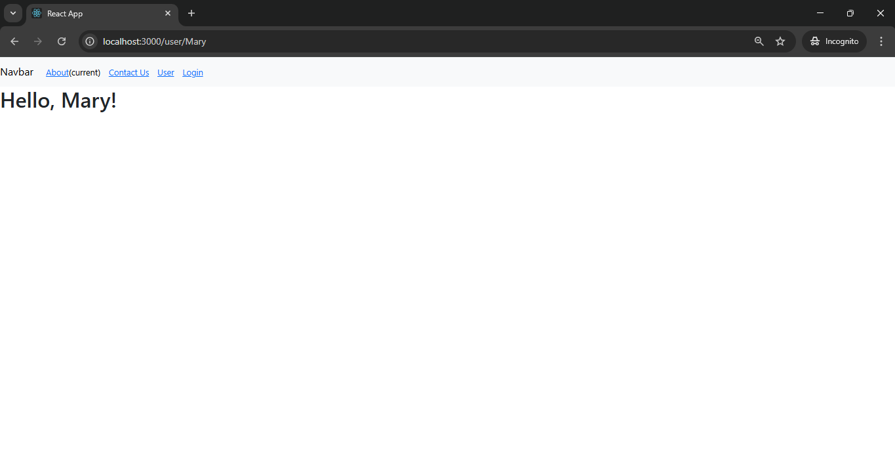


---

### Routing Demo Summary

The routing mini-application demonstrated how `react-router-dom` enables navigation between multiple views within a single-page React application. Different URL paths map to different components without requiring a full page reload. The `PrivateRoute` component protects sensitive routes by checking the `authorized` prop and redirecting unauthenticated users to the login page, saving their intended destination so they can be redirected there after logging in. The `useNavigate`, `useLocation`, and `useParams` hooks simplify working with routing state inside components.

**New terminology defined:**

- **BrowserRouter**: The top-level wrapper component that enables HTML5 history-based routing in a React app.
- **Routes**: The parent container for all individual `Route` definitions.
- **Route**: Maps a URL path to a React component. When the browser URL matches `path`, the specified `element` is rendered.
- **Link**: A React Router component that renders an anchor tag and navigates between routes without a full page reload.
- **useNavigate**: A React Router hook that returns a function used to programmatically navigate to a different route.
- **useLocation**: A React Router hook that returns the current URL location object, including `pathname` and `state`.
- **useParams**: A React Router hook that extracts dynamic URL parameters (e.g., `:username`) from the current route.
- **PrivateRoute**: A custom component pattern that conditionally renders a protected component or redirects to login based on authentication state.
- **Callback hell**: A situation in asynchronous code where multiple nested callbacks become difficult to read and maintain, solved by using `async/await`.

---

---

## Part 4 – Navigation Routing

### Overview

Part 4 returned to the music application and applied routing. The application was refactored to separate concerns into dedicated components (`AlbumList`, `SearchAlbum`, `NewAlbum`, `OneAlbum`, `NavBar`). React Router v6 was used to define routes for the main search view, a new album form, and a single album detail view.

---

### Refactoring: New Components

**AlbumList.js** – Responsible for rendering a list of `<Card />` components from the `albumList` prop. Uses `useNavigate` to handle card selection and passes the selected album ID and navigator back up via `props.onClick`.

```js
import React from 'react';
import Card from './Card';
import { useNavigate } from 'react-router-dom';

const AlbumList = (props) => {
  const handleSelectionOne = (albumId) => {
    console.log('Selected ID is ' + albumId);
    props.onClick(albumId, navigator);
  };

  const navigator = useNavigate();
  const albums = props.albumList.map((album) => {
    return (
      <Card
        key={album.id}
        albumId={album.id}
        albumTitle={album.title}
        albumDescription={album.description}
        buttonText='OK'
        imgURL={album.image}
        onClick={handleSelectionOne}
      />
    );
  });
  return <div className='container'>{albums}</div>;
};

export default AlbumList;
```

**SearchAlbum.js** – Acts as the direct parent of both `SearchForm` and `AlbumList`. Passes props from `App.js` down to its children.

```js
import React from 'react';
import SearchForm from './SearchForm';
import AlbumList from './AlbumList';

const SearchAlbum = (props) => {
  console.log('props with update single album ', props);
  return (
    <div className='container'>
      <SearchForm onSubmit={props.updateSearchResults} />
      <AlbumList albumList={props.albumList} onClick={props.updateSingleAlbum} />
    </div>
  );
};

export default SearchAlbum;
```

**NewAlbum.js** – A stub component for adding new albums (to be completed in Activity 7).

```js
import React from 'react';

const NewAlbum = () => {
  return <div>This is a New Album Form</div>;
};

export default NewAlbum;
```

**OneAlbum.js** – Displays full details of a single selected album, including a placeholder for tracks, lyrics, and a YouTube video section.

**NavBar.js** – Bootstrap navbar with links to `Main` (route `/`) and `New` (route `/new`).

---

### Refactored App.js: renderedList

`renderedList` was simplified from a function that returns JSX to a plain filtered array passed as a prop:

```js
const renderedList = albumList.filter((album) => {
  if (
    album.description.toLowerCase().includes(searchPhrase.toLowerCase()) ||
    searchPhrase === ''
  ) {
    return true;
  }
  return false;
});
```

---

### Application Routing in App.js

`react-router-dom` was added to the music application:

```
npm install react-router-dom
```

The `return` of `App.js` was updated to define three routes:

```js
return (
  <BrowserRouter>
    <NavBar />
    <Routes>
      <Route
        exact
        path='/'
        element={
          <SearchAlbum
            updateSearchResults={updateSearchResults}
            albumList={renderedList}
            updateSingleAlbum={updateSingleAlbum}
          />
        }
      />
      <Route exact path='/new' element={<NewAlbum />} />
      <Route
        exact
        path='/show/:albumId'
        element={<OneAlbum album={albumList[currentlySelectedAlbumId]} />}
      />
    </Routes>
  </BrowserRouter>
);
```

The `updateSingleAlbum` function finds the selected album by ID, stores its index, and navigates to the `/show/:albumId` route:

```js
const updateSingleAlbum = (id, navigate) => {
  var indexNumber = 0;
  for (var i = 0; i < albumList.length; ++i) {
    if (albumList[i].id === id) indexNumber = i;
  }
  setCurrentlySelectedAlbumId(indexNumber);
  navigate('/show/' + indexNumber);
};
```

---

### Screenshots

> **Music app home page at localhost:3000/ showing NavBar and album cards**

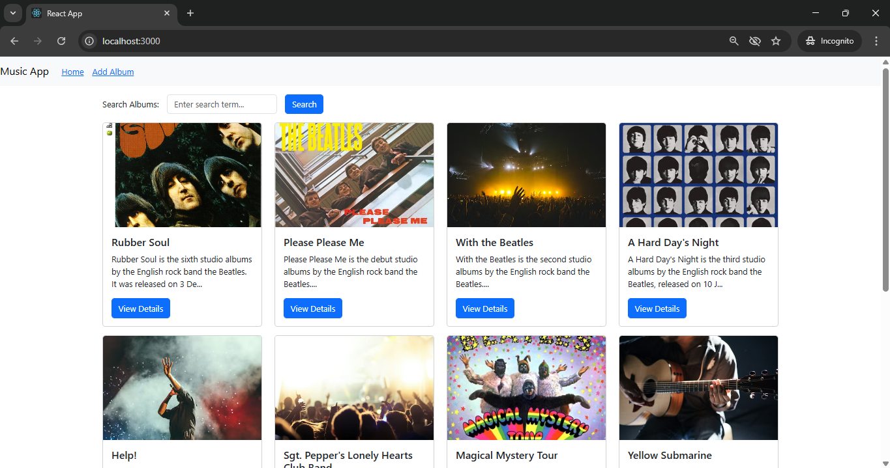


> **Search filtering working through the SearchAlbum component**

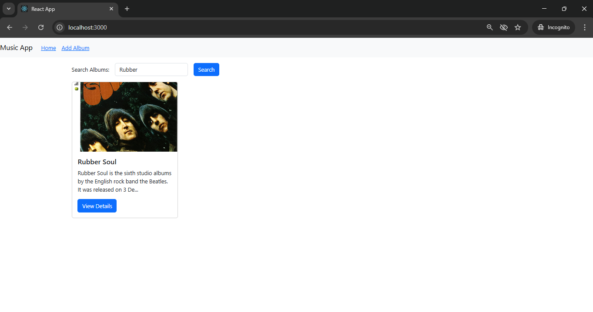

> **/new route showing**

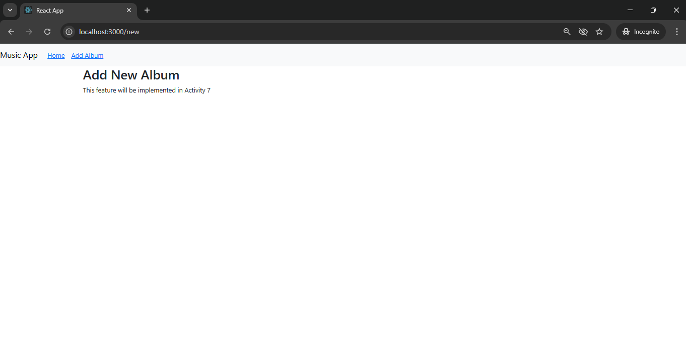

> **/show/:albumId route showing OneAlbum detail view**

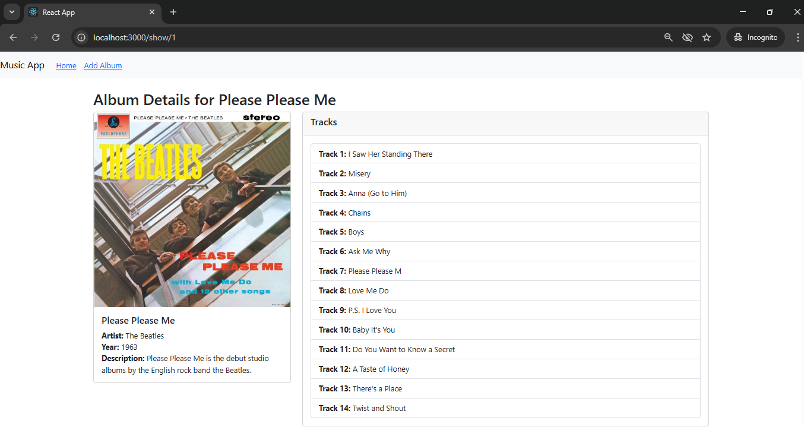

> **Screenshot 23 – Browser console showing updateSingleAlbum logs when a card is clicked**

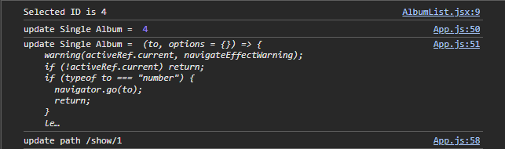

> **Screenshot 24 – Complete App.js open in VS Code (Parts 1, 2, and 3)**


---

### Part 4 Summary

In Part 4, the music application was refactored and extended with navigation routing using `react-router-dom`. The large `App.js` component was broken up by extracting `AlbumList` and `SearchAlbum` as dedicated child components, following the React best practice of separating concerns into focused components. Three routes were defined: the root path (`/`) renders the search and album list view, `/new` renders a stub form for adding albums, and `/show/:albumId` renders a detail view for a single selected album. Clicking an album card triggers the `updateSingleAlbum` callback, which finds the album's index, stores it in state, and uses `navigate()` to route to the detail page.

**New terminology defined:**

- **react-router-dom**: A React library that provides components and hooks for client-side URL routing in web applications.
- **BrowserRouter**: Wraps the application and enables URL-based routing using the HTML5 History API.
- **Route / Routes**: `Routes` is the container; each `Route` maps a `path` to a component `element` to render.
- **useNavigate (in AlbumList)**: Hook used inside `AlbumList` to get a navigation function, which is then passed up to the parent via callback so the parent can control routing.
- **currentlySelectedAlbumId**: A state variable in `App.js` that stores the array index of the currently selected album, used to pass the correct album object to `OneAlbum`.
- **AlbumList**: A new component that encapsulates the rendering of album cards, extracted from the `renderedList` helper function in `App.js`.
- **SearchAlbum**: A container component that combines `SearchForm` and `AlbumList`, acting as an intermediary that passes props from `App.js` to its children.
- **OneAlbum**: A detail view component that receives a single album object as a prop and displays its full information including placeholders for tracks, lyrics, and video.
- **NewAlbum**: A stub component that represents a future form for creating new albums (to be developed in Activity 7).
