# Activity 7: React Music App Completion

**Course:** Web Application Development  
**Instructor:** Bobby Estey  
**Author:**   Adewale Olaom  
**Date:** March 27, 2026

## Mini App #3 – Dynamic Components Demo

### Overview

A new React application called `blog` was created to demonstrate how to dynamically add and remove components from a list. The application displays blog posts and allows users to add new posts using a text area form and delete existing posts using a delete button. This mini-app teaches the skills needed to manage dynamic lists in React, which are directly applied to the music application later.

---

### Setup

```
npx create-react-app blog
cd blog
npm start
```

`App.css` and `logo.svg` were deleted. The project was opened in Visual Studio Code.

---

### Feature 1: Displaying a Single Blog Post

`App.js` was set up with an initial state containing one blog post object. A `Post.js` component was created to receive `text` and `id` as props and display them.

**App.js (initial):**
```js
import React, { useState } from 'react';
import Post from './Post';

function App() {
  const [postList, setPostList] = useState([
    {
      postNumber: 0,
      text: 'A short psychic broke out of jail. She was a small medium at large.',
    },
  ]);

  return (
    <div>
      <Post text={postList[0].text} id={postList[0].postNumber} />
    </div>
  );
}

export default App;
```

**Post.js:**
```js
import React from 'react';
import './Post.css';

const Post = (props) => {
  return (
    <div className='post-container'>
      <span> Blog entry # {props.id}</span>
      <p>{props.text}</p>
    </div>
  );
};

export default Post;
```

**Post.css:**
```css
.post-container {
  border: 1px solid black;
  border-radius: 5px;
  background-color: #eee;
  padding: 10px;
  margin: 10px;
}

span {
  font-weight: bold;
}
```

> **Blog app showing single post in the browser**

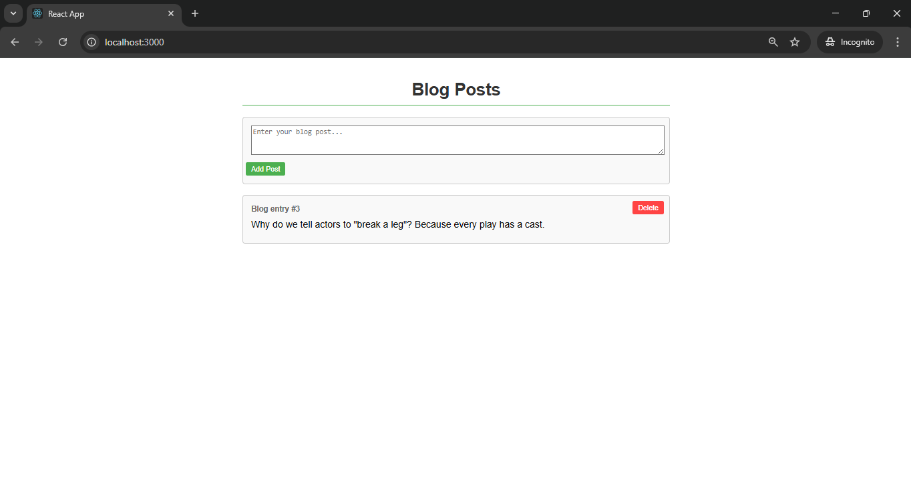

---

### Feature 2: Rendering Multiple Posts with .map()

Multiple blog post objects were added to the `postList` state array. The `postList.map()` function was used to dynamically render a `<Post />` component for each entry. Each `<Post />` receives a `key` prop (using `postNumber`) to allow React to track list changes efficiently.

```js
const posts = postList.map((post) => (
  <Post key={post.postNumber} text={post.text} id={post.postNumber} />
));

return (
  <div>
    {posts}
  </div>
);
```

> **Screenshot 2 – Blog app showing multiple posts rendered from the state array**

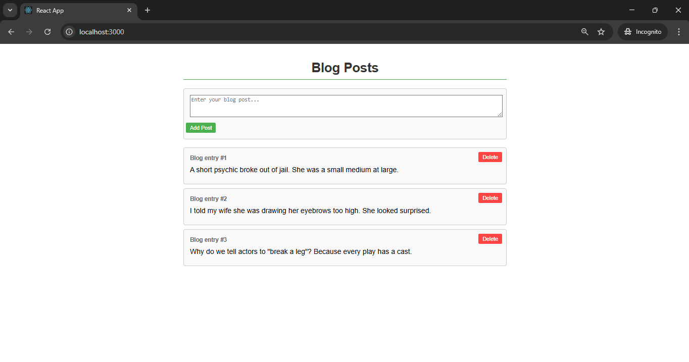

---

### Feature 3: Delete Button on Each Post

A Delete button was added to `Post.js`. Its `onClick` calls `props.onDelete(props.id)` using arrow function syntax to pass the post ID back to the parent.

**Updated Post.js:**
```js
const Post = (props) => {
  return (
    <div className='post-container'>
      <span> Blog entry # {props.id}</span>
      <p>{props.text}</p>
      <button onClick={() => props.onDelete(props.id)}>Delete</button>
    </div>
  );
};
```

The `handleDeletePost` method was added to `App.js`. It filters out the deleted post by ID and updates state with `setPostList`. The `onDelete` prop is passed to each `<Post />` in the `.map()` call.

**App.js – handleDeletePost:**
```js
const handleDeletePost = (id) => {
  let updatedPostList = postList.filter(post => post.postNumber !== id);
  setPostList(updatedPostList);
};

const posts = postList.map((post) => (
  <Post
    key={post.postNumber}
    text={post.text}
    id={post.postNumber}
    onDelete={handleDeletePost}
  />
));
```

> **Blog app showing posts with Delete buttons**

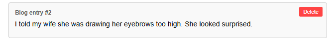

> **Blog app after deleting a post (one post removed)**

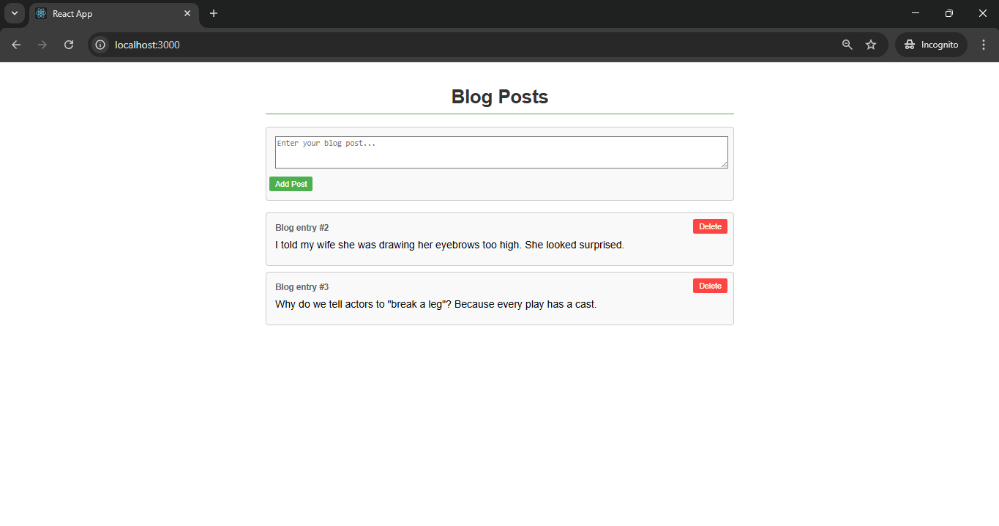

---

### Feature 4: Adding a New Post with AddPost Component

A new `AddPost.js` component was created. It is a **controlled component** — its `<textarea>` value is bound to a state variable `text`, which is updated on every `onChange` event. When the Add button is clicked, it calls `props.onAdd(text)` to send the text back to the parent.

**AddPost.js:**
```js
import React, { useState } from 'react';
import './Post.css';

const AddPost = (props) => {
  const [text, setText] = useState('');

  const updateText = (event) => {
    setText(event.target.value);
    console.log('Text of input is ', text);
  };

  return (
    <div className='post-container'>
      <textarea onChange={updateText} type='text' value={text} />
      <br />
      <button onClick={() => props.onAdd(text)}>Add</button>
    </div>
  );
};

export default AddPost;
```

The `handleAddPost` method was added to `App.js`. It creates a new post object using the current `postId` state value and the text from `AddPost`. The spread syntax (`...postList`) is used to append the new post to the existing array without mutating state directly. The `postId` state is incremented after each addition.

**App.js – handleAddPost:**
```js
const [postId, setPostId] = useState(3);

const handleAddPost = (newText) => {
  let newPost = {
    postNumber: postId,
    text: newText
  };
  setPostList(postList => [...postList, newPost]);
  setPostId(postId + 1);
};
```

**App.js – return with AddPost:**
```js
return (
  <div>
    {posts}
    <AddPost onAdd={handleAddPost} />
  </div>
);
```

> **Blog app showing the AddPost text area box**

 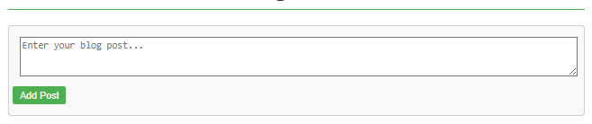


> **Blog app after typing in the text area and clicking Add (new post appears)**

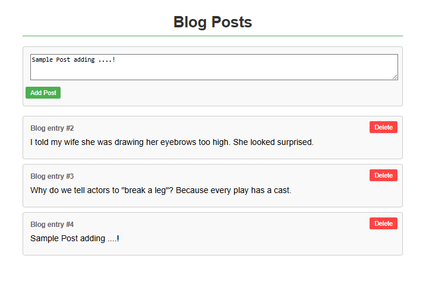


---

### Dynamic Components Demo Summary

This mini-application demonstrated how to dynamically add and remove React components from a rendered list. Blog posts were stored in the `postList` state array in `App.js`. The `postList.map()` function converted each post object into a `<Post />` component. Deleting a post used `Array.filter()` to remove the matching entry by ID and called `setPostList()` to update state, triggering a re-render. Adding a post used the spread syntax (`...`) to append a new object to the existing array. The `AddPost` component is a controlled component — its internal text value is always synchronized with its state via `onChange`. Callbacks allowed child components (`Post` and `AddPost`) to send data and events back up to the parent `App`, which owns and manages all state.

**New terminology defined:**

- **Controlled component**: A React component where the form element's value is tied directly to a state variable. The state is updated on every `onChange` event, keeping the UI and state always in sync.
- **Array.filter()**: A JavaScript method that returns a new array containing only elements that pass a given test. Used here to remove a deleted post from the list without mutating the original array.
- **Spread syntax (`...`)**: JavaScript syntax that expands an iterable (like an array) into individual elements. Used as `[...postList, newPost]` to create a new array with all existing posts plus the new one, rather than mutating state directly.
- **Array.map()**: A JavaScript method that creates a new array by applying a function to each element. Used to convert each post object in state into a `<Post />` JSX element.
- **key prop**: A special React prop that must be unique among sibling components in a list. React uses it internally to efficiently track, update, and reconcile list elements during re-renders.
- **Dynamic component**: A React component that is added to or removed from the DOM at runtime based on changes in state, rather than being statically defined in the JSX.

---

---

## Part 5 – Tracks, Lyrics and Video

### Overview

Part 5 extended the `OneAlbum` component in the music application to be interactive. Four new child components were designed to display album tracks, allow track selection, show lyrics, and embed a video for the selected track. This applied the same dynamic list techniques from the blog mini-app.

---

### Component Design

The `OneAlbum` component was designed to include four new child components:

| Component         | Purpose                                                                    |
| ----------------- | -------------------------------------------------------------------------- |
| `<TracksList />`  | Container component that renders the list of tracks for the selected album |
| `<TrackTitle />`  | Renders a single track title; clicking it sets the selected track          |
| `<TrackLyrics />` | Displays the lyrics of the currently selected track                        |
| `<TrackVideo />`  | Displays the YouTube video for the currently selected track                |

The `selectedTrack` state variable in `OneAlbum` changes when the user clicks a track title. `TrackLyrics` and `TrackVideo` then render content based on the selected track.

---

### Key Concepts Applied

- `TracksList` uses `props.tracks.map()` to render a `<TrackTitle />` for each track, passing an `onClick` callback down.
- Clicking a `TrackTitle` calls `setSelectedTrack()` in `OneAlbum`, triggering a re-render.
- `TrackLyrics` and `TrackVideo` receive the `selectedTrack` object as a prop and display its `lyrics` and `video` fields.

---

### Screenshots

> **OneAlbum page showing the album detail layout**

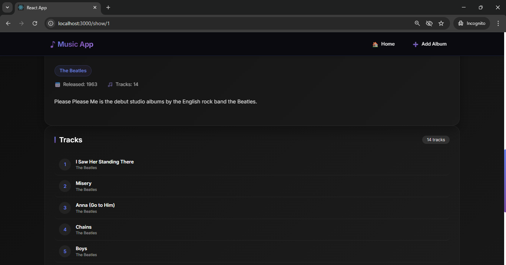

> **OneAlbum page showing the TracksList with clickable track titles**

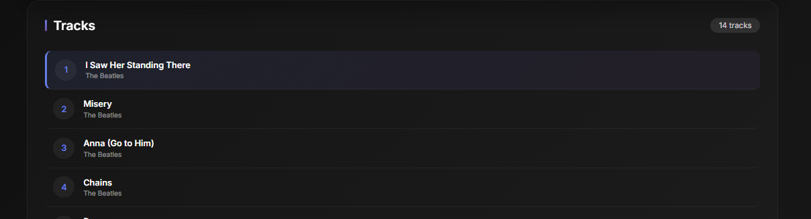

> **OneAlbum page after clicking a track title (lyrics and/or video area updates)**

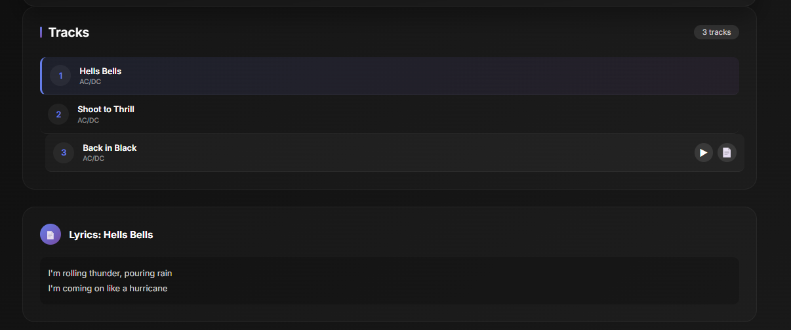

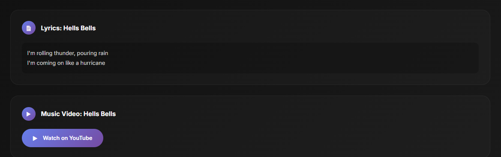

---

### Part 5 Summary

In Part 5, the `OneAlbum` component was extended to become a fully interactive album detail view. Four new components were created: `TracksList`, `TrackTitle`, `TrackLyrics`, and `TrackVideo`. The same dynamic list pattern from the blog mini-app was applied — `TracksList` uses `.map()` to render a `TrackTitle` for each track in the album's data. Clicking a track title uses a callback to update the `selectedTrack` state in `OneAlbum`, which then passes the selected track's lyrics and video URL down to `TrackLyrics` and `TrackVideo` as props. This demonstrates the standard React pattern: state lives in the parent, and data flows down to children through props while events flow back up through callbacks.

**New terminology defined:**

- **selectedTrack**: A state variable in `OneAlbum` that stores the currently chosen track object. When it changes (via a user click), React re-renders the component and updates the lyrics and video display.
- **TracksList**: A container component that receives the `tracks` array as a prop and maps it into individual `TrackTitle` components.
- **TrackTitle**: A presentational component that displays one track title and triggers a parent callback on click to change the selected track.
- **TrackLyrics**: A display component that shows the `lyrics` field of the currently selected track passed via props.
- **TrackVideo**: A display component that embeds or links the YouTube video for the selected track using the `video` field from props.

---


## Part 6 – Create New Album

### Overview

Part 6 replaced the `NewAlbum` stub component with a fully functional data entry form. The form used Bootstrap styling, controlled React components, and `async/await` with Axios to POST the new album to the Express REST API. After a successful save, the app reloads the album list and navigates back to the main page.

---

### Feature 1: Building the Form with Bootstrap and JSX

The Bootstrap Forms example was used as a starting point. The HTML was pasted into `NewAlbum.js` and modified to conform to JSX standards — all tags are properly closed, and `class` is replaced with `className`. The form was customized to collect the fields needed for a new album: Title, Artist, Description, Year, and Image URL.

```js
import React from 'react';

const NewAlbum = () => {
  return (
    <div className='container'>
      <form>
        <h1>Create Album</h1>
        <div className='form-group'>
          <label htmlFor='albumTitle'>Album Title</label>
          <input type='text' className='form-control' id='albumTitle'
            placeholder='Enter Album Title' onChange={updateTitle} />
          <label htmlFor='albumArtist'>Artist</label>
          <input type='text' className='form-control' id='albumArtist'
            placeholder='Enter Album Artist' onChange={updateArtist} />
          <label htmlFor='albumDescription'>Description</label>
          <textarea type='text' className='form-control' id='albumDescription'
            placeholder='Enter Album Description' onChange={updateDescription} />
          <label htmlFor='albumYear'>Year</label>
          <input type='text' className='form-control' id='albumYear'
            placeholder='Enter Album Year' onChange={updateYear} />
          <label htmlFor='albumImage'>Image</label>
          <input type='text' className='form-control' id='albumImage'
            placeholder='Enter Album Image' onChange={updateImage} />
        </div>
        <div align='center'>
          <button type='button' className='btn btn-light' onClick={handleCancel}>Cancel</button>
          <button type='submit' className='btn btn-primary'>Submit</button>
        </div>
      </form>
    </div>
  );
};
```

> **NewAlbum form visible in the browser at /new**

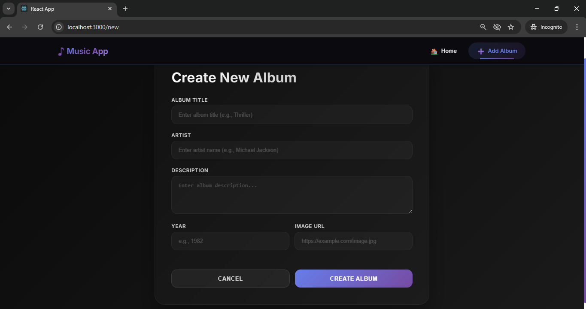

---

### Feature 2: Controlled Components with useState

Each form field was turned into a controlled component using `useState`. An individual `onChange` handler was created for each field to update its corresponding state variable on every keystroke. `useNavigate` was also imported for post-submit navigation.

```js
import React, { useState } from 'react';
import dataSource from './dataSource';
import { useNavigate } from 'react-router-dom';

const NewAlbum = (props) => {
  const [albumTitle, setAlbumTitle] = useState('');
  const [artist, setArtist] = useState('');
  const [description, setDescription] = useState('');
  const [year, setYear] = useState('');
  const [image, setImage] = useState('');
  const navigate = useNavigate();

  const updateTitle = (event) => { setAlbumTitle(event.target.value); };
  const updateArtist = (event) => { setArtist(event.target.value); };
  const updateDescription = (event) => { setDescription(event.target.value); };
  const updateYear = (event) => { setYear(event.target.value); };
  const updateImage = (event) => { setImage(event.target.value); };
```

---

### Feature 3: Form Submit, saveAlbum, and onNewAlbum Callback

`handleFormSubmit` prevents the default browser form submission, builds the album object from state, and calls `saveAlbum`. The `saveAlbum` function uses `dataSource.post('/albums', album)` to send the new album to the REST API via a POST request. After saving, it calls `props.onNewAlbum(navigate)` — a callback from `App.js` that reloads the album list and navigates back to the root route.

```js
const handleFormSubmit = (event) => {
  event.preventDefault();
  console.log("submit");
  const album = {
    title: albumTitle,
    artist: artist,
    description: description,
    year: year,
    image: image,
    tracks: [],
  };
  console.log(album);
  saveAlbum(album);
};

const saveAlbum = async (album) => {
  const response = await dataSource.post('/albums', album);
  console.log(response);
  console.log(response.data);
  props.onNewAlbum(navigate);
};

const handleCancel = () => {
  navigate("/");
};
```

**App.js – onNewAlbum callback and updated route:**
```js
const onNewAlbum = (navigate) => {
  loadAlbums();
  navigate("/");
};

// In the return:
<Route exact path='/new' element={<NewAlbum onNewAlbum={onNewAlbum} />} />
```

> **New album form filled in with data**

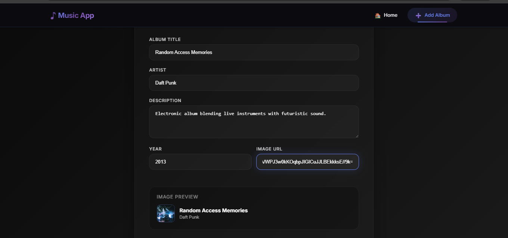

> **Main album list after submitting the new album (new album card appears)**

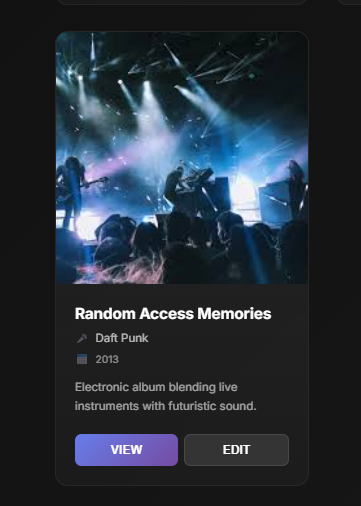

> **Browser console showing "submit" and album object logged after form submission**

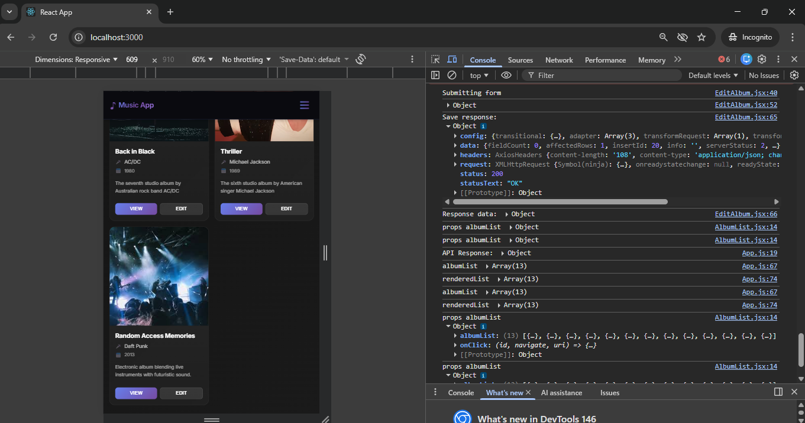


---

### Part 6 Summary

In Part 6, the `NewAlbum` placeholder component was replaced with a complete data entry form. The form was based on Bootstrap's form template and adapted to JSX by closing all tags and replacing `class` with `className`. Each input field was made into a controlled component by connecting its `value` to a `useState` variable and providing an `onChange` handler that updates the state on every keystroke. When the form is submitted, `handleFormSubmit` prevents the browser default, assembles the album object from all state variables, and calls `saveAlbum`, which uses Axios to send a `POST` request to the Express REST API. After the server confirms the save, the `onNewAlbum` callback from `App.js` is invoked, reloading the album list from the database and navigating back to the main page.

**New terminology defined:**

- **Controlled component**: A form element (input, textarea, select) whose value is always driven by React state. Every keystroke triggers `onChange`, which updates state, which re-renders the input with the new value.
- **handleFormSubmit**: The function that handles a form's `onSubmit` event. It calls `event.preventDefault()` to stop the browser's default form POST behavior, then manually handles submission with JavaScript.
- **event.preventDefault()**: A JavaScript method called on the form submit event to stop the browser from reloading or redirecting the page when a form is submitted.
- **dataSource.post()**: An Axios method that sends an HTTP POST request to the specified endpoint with the provided data as the request body. Used here to create a new album in the database.
- **POST (HTTP method)**: The REST convention for creating a new resource on the server. In this app, `POST /albums` creates a new album record in the MySQL database.
- **onNewAlbum callback**: A method defined in `App.js` and passed as a prop to `NewAlbum`. After a successful save, `NewAlbum` calls this to reload the album list and navigate back to the home route.
- **JSX form requirements**: In JSX, `class` must be written as `className`, all HTML elements must be properly closed (including self-closing tags like `<input />`), and `for` in labels must be written as `htmlFor`.

---

---

## Part 7 – Edit an Album

### Overview

Part 7 extended the music application to support editing existing albums. Rather than creating a separate `EditAlbum` component by copying `NewAlbum`, `NewAlbum` was renamed to `EditAlbum` and modified to handle both create and edit modes in a single component. The mode is determined by whether `props.album` is present. The `saveAlbum` function uses a REST `PUT` request when editing and a `POST` request when creating. `Card.js` was updated to add an Edit button alongside the existing View button.

---

### Feature 1: Renaming NewAlbum to EditAlbum

`NewAlbum.js` was renamed to `EditAlbum.js`. The component name, its import in `App.js`, and its use in the route definitions were all updated accordingly.

---

### Feature 2: New vs. Edit Mode Logic

At the top of `EditAlbum`, a default empty album is defined and `newAlbumCreation` is set to `true`. If `props.album` is present (meaning the user clicked Edit on an existing album), the album object is set to `props.album` and `newAlbumCreation` is set to `false`. The `useState` calls then initialize each field using the album's existing values.

```js
// Assume New Album by default
let album = {
  title: '',
  artist: '',
  description: '',
  year: '',
  image: '',
  tracks: [],
};
let newAlbumCreation = true;

// If an album is provided in props, we are editing
if (props.album) {
  album = props.album;
  newAlbumCreation = false;
}

// Initialize state from album (empty strings for new, existing values for edit)
const [albumTitle, setAlbumTitle] = useState(album.title);
const [artist, setArtist] = useState(album.artist);
const [description, setDescription] = useState(album.description);
const [year, setYear] = useState(album.year);
const [image, setImage] = useState(album.image);
```

---

### Feature 3: handleFormSubmit Preserves albumId When Editing

When editing, the original `albumId` is included in the `editedAlbum` object. This is required by the REST API's `PUT` endpoint to identify which record to update. When creating a new album, the server assigns the ID automatically so it is not needed.

```js
const handleFormSubmit = (event) => {
  event.preventDefault();
  console.log("submit");
  const editedAlbum = {
    // albumId is required for PUT (edit); ignored on POST (new)
    albumId: album.albumId,
    title: albumTitle,
    artist: artist,
    description: description,
    year: year,
    image: image,
    tracks: [],
  };
  console.log(editedAlbum);
  saveAlbum(editedAlbum);
};
```

---

### Feature 4: saveAlbum Uses POST or PUT

The `saveAlbum` function checks `newAlbumCreation` to decide whether to use `dataSource.post()` (create) or `dataSource.put()` (update). After saving, it calls `props.onEditAlbum(navigate)` — the renamed callback from `App.js`.

```js
const saveAlbum = async (album) => {
  let response;
  if (newAlbumCreation)
    response = await dataSource.post('/albums', album);
  else
    response = await dataSource.put('/albums', album);
  console.log(response);
  console.log(response.data);
  props.onEditAlbum(navigate);
};
```

---

### Feature 5: Dynamic Page Title

The `<h1>` title in the form switches between "Create New" and "Edit" based on the `newAlbumCreation` flag, using a ternary expression.

```js
<h1>{newAlbumCreation ? "Create New" : "Edit"} Album</h1>
```

---

### Feature 6: Updated App.js Routes

`App.js` was updated to rename `onNewAlbum` to `onEditAlbum` and add a new `/edit/:albumId` route. Both the `/new` and `/edit/:albumId` routes use the `EditAlbum` component. The edit route also passes `album={albumList[currentlySelectedAlbumId]}` as a prop so `EditAlbum` knows which album to pre-fill.

```js
const onEditAlbum = (navigate) => {
  loadAlbums();
  navigate("/");
};

// In the return:
<Route exact path='/new'
  element={<EditAlbum onEditAlbum={onEditAlbum} />} />
<Route exact path='/edit/:albumId'
  element={<EditAlbum onEditAlbum={onEditAlbum}
    album={albumList[currentlySelectedAlbumId]} />} />
<Route exact path='/show/:albumId'
  element={<OneAlbum album={albumList[currentlySelectedAlbumId]} />} />
```

---

### Feature 7: updateSingleAlbum Now Accepts a URI Parameter

`updateSingleAlbum` in `App.js` was updated to accept a `uri` parameter. This allows the same function to navigate to either `/show/` or `/edit/` depending on which button was clicked on the card.

```js
const updateSingleAlbum = (id, navigate, uri) => {
  console.log('Update Single Album = ', id);
  var indexNumber = 0;
  for (var i = 0; i < albumList.length; ++i) {
    if (albumList[i].id === id) indexNumber = i;
  }
  setCurrentlySelectedAlbumId(indexNumber);
  let path = uri + indexNumber;
  console.log('path', path);
  navigate(path);
};
```

---

### Feature 8: Edit Button Added to Card.js

`Card.js` was updated to add a second button labeled "Edit" alongside the existing View button. Each button passes a different URI (`'/show/'` or `'/edit/'`) to `handleButtonClick`, which then calls `props.onClick(props.albumId, uri)` to trigger navigation via `updateSingleAlbum`.

```js
const Card = (props) => {
  const handleButtonClick = (event, uri) => {
    console.log('ID clicked is ' + props.albumId);
    props.onClick(props.albumId, uri);
  };

  return (
    <div className='card' style={{ width: '18rem' }}>
      
      <div className='card-body'>
        <h5 className='card-title'>{props.albumTitle}</h5>
        <p className='card-text'>{props.albumDescription}</p>
        <button
          onClick={() => handleButtonClick(props.albumId, '/show/')}
          className='btn btn-primary'
        >
          {props.buttonText}
        </button>
        <button
          onClick={() => handleButtonClick(props.albumId, '/edit/')}
          className='btn btn-secondary'
        >
          Edit
        </button>
      </div>
    </div>
  );
};
```

---

### Screenshots

> **Main album list showing both "View" and "Edit" buttons on each card**

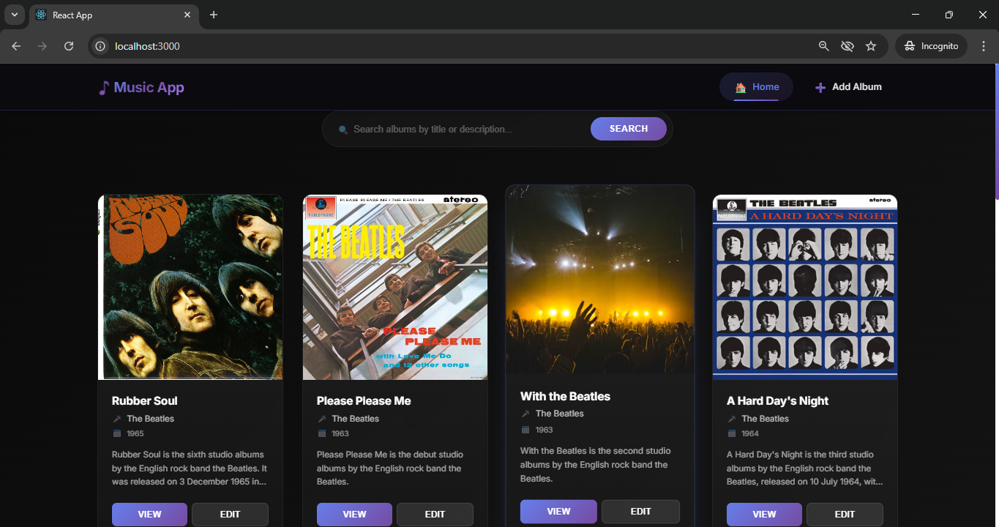

> **Edit Album form pre-filled with existing album data after clicking Edit**

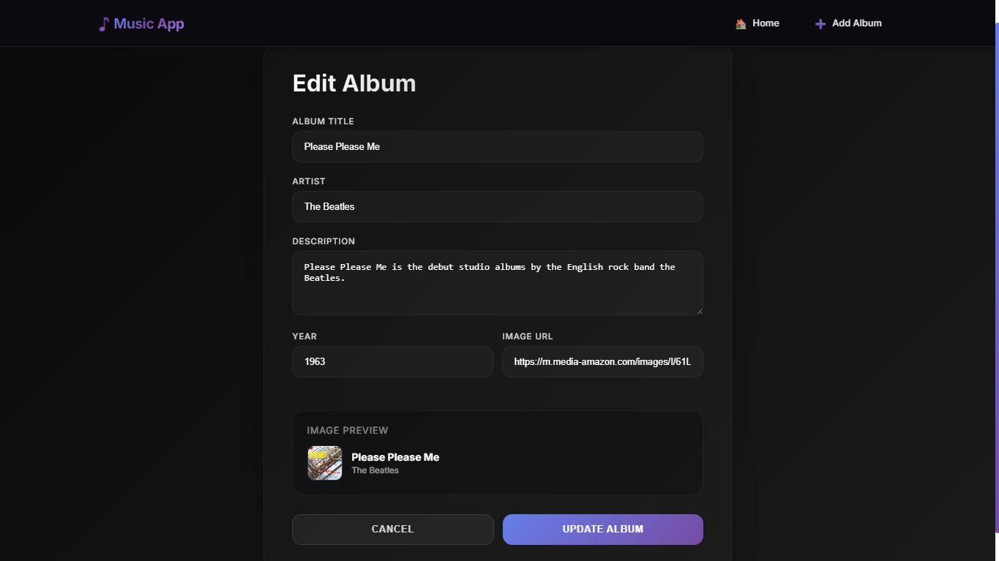


> **App.js showing both /new and /edit/:albumId routes in VS Code**

```js
import React, { useState, useEffect } from "react";
import { Route, Routes, BrowserRouter } from "react-router-dom";
import SearchAlbum from "./SearchAlbum";
import NavBar from "./Navbar";
import EditAlbum from "./EditAlbum"; 
import OneAlbum from "./OneAlbum";
import "./App.css";
import dataSource from "./dataSource";

const App = () => {
  const [searchPhrase, setSearchPhrase] = useState("");
  const [albumList, setAlbumList] = useState([]);
  const [currentlySelectedAlbumId, setCurrentlySelectedAlbumId] = useState(0);
  let refresh = false;

  const loadAlbums = async () => {
    try {
      const response = await dataSource.get("/albums");
      console.log("API Response:", response.data);

      if (
        response.data &&
        response.data.albums &&
        Array.isArray(response.data.albums)
      ) {
        setAlbumList(response.data.albums);
      } else {
        console.error("Unexpected data format:", response.data);
        setAlbumList([]);
      }
    } catch (error) {
      console.error("Error loading albums:", error);
      setAlbumList([]);
    }
  };

  useEffect(() => {
    loadAlbums();
  }, [refresh]);

  const updateSearchResults = async (phrase) => {
    console.log("phrase is " + phrase);
    setSearchPhrase(phrase);
  };

  const updateSingleAlbum = (id, navigate, uri) => {
    console.log("Update Single Album = ", id);
    console.log("Update Single Album = ", navigate);

    const index = albumList.findIndex((album) => album.albumId === id);

    if (index !== -1) {
      setCurrentlySelectedAlbumId(index);
      let path = uri + "/" + index;
      console.log("path", path);
      navigate(path);
    } else {
      console.error("Album not found with id:", id);
    }
  };

  const onEditAlbum = (navigate) => {
    loadAlbums();
    navigate("/");
  };

  console.log("albumList", albumList);

  const renderedList = albumList.filter((album) => {
    if (searchPhrase === "") return true;
    return album.description.toLowerCase().includes(searchPhrase.toLowerCase());
  });

  console.log("renderedList", renderedList);

  const selectedAlbum = albumList[currentlySelectedAlbumId] || null;

  return (
    <BrowserRouter>
      <NavBar />
      <Routes>
        <Route
          exact
          path="/"
          element={
            <SearchAlbum
              albumList={renderedList}
              onSubmit={updateSearchResults}
              onClick={updateSingleAlbum}
            />
          }
        />
        <Route
          exact
          path="/new"
          element={<EditAlbum onEditAlbum={onEditAlbum} />}
        />
        <Route
          exact
          path="/edit/:albumId"
          element={
            <EditAlbum album={selectedAlbum} onEditAlbum={onEditAlbum} />
          }
        />
        <Route
          exact
          path="/show/:albumId"
          element={<OneAlbum album={selectedAlbum} />}
        />
      </Routes>
    </BrowserRouter>
  );
};

export default App;
```

---

### Part 7 Summary

In Part 7, the application was extended to support editing existing albums. Rather than duplicating `NewAlbum` into a separate `EditAlbum` component, `NewAlbum` was renamed to `EditAlbum` and modified to serve both purposes. At initialization, the component checks if `props.album` is present — if it is, the form pre-fills all fields with the album's existing data and sets `newAlbumCreation = false`; otherwise, all fields start empty and `newAlbumCreation = true`. The `saveAlbum` function uses this flag to choose between a `POST` request (create) and a `PUT` request (update). The `App.js` routing was updated to include a new `/edit/:albumId` route that passes the selected album object to `EditAlbum`. The `Card.js` component was updated to include an Edit button alongside the View button, each passing a different URI (`/edit/` or `/show/`) to the `updateSingleAlbum` callback. This enabled full CRUD navigation within the React application.

**New terminology defined:**

- **PUT (HTTP method)**: The REST convention for updating an existing resource on the server. In this app, `PUT /albums` updates the album record matching the provided `albumId` in the database.
- **POST vs PUT**: `POST` is used to create a new resource (the server assigns an ID). `PUT` is used to update an existing resource (the client must provide the ID of the record to update).
- **newAlbumCreation flag**: A boolean variable in `EditAlbum` that tracks whether the component is being used for creating a new album (`true`) or editing an existing one (`false`). It controls which HTTP method is used and what the page title displays.
- **Ternary expression**: JavaScript shorthand for an if-else statement, written as `condition ? valueIfTrue : valueIfFalse`. Used here to switch the page heading between "Create New" and "Edit".
- **props.album**: The album object passed from `App.js` to `EditAlbum` when the Edit button is clicked. Its presence signals that the component is in edit mode.
- **onEditAlbum callback**: A method defined in `App.js` and passed as a prop to `EditAlbum`. Called after a successful save to reload the album list from the database and navigate back to the home route.
- **URI parameter in updateSingleAlbum**: A new parameter added to `updateSingleAlbum` that allows the same function to navigate to different routes (`/show/` or `/edit/`) depending on which button triggered the call.
- **Intermediate callback**: A callback method in a middle component (like `AlbumList`) that exists only to pass an event further up the chain. The guide notes these can be factored out — the child component can call the top-level parent method directly by passing it through each level as a prop attribute.
